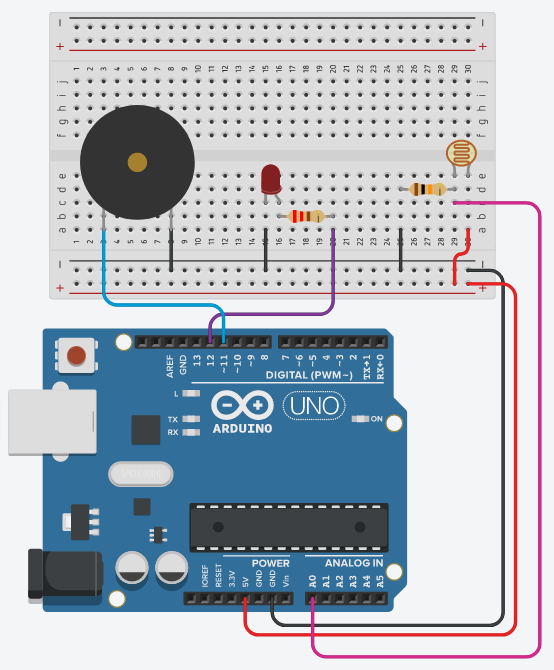

# Light sensor with Arduino

Light sensor circuit with photoresistor, LED and a Buzzer.

## Components:

- 1x Active Buzzer
- 1x Photoresistor
- 1x 10kΩ Resistor
- 1x 220Ω Resistor
- 1x LED

## Schematic:

